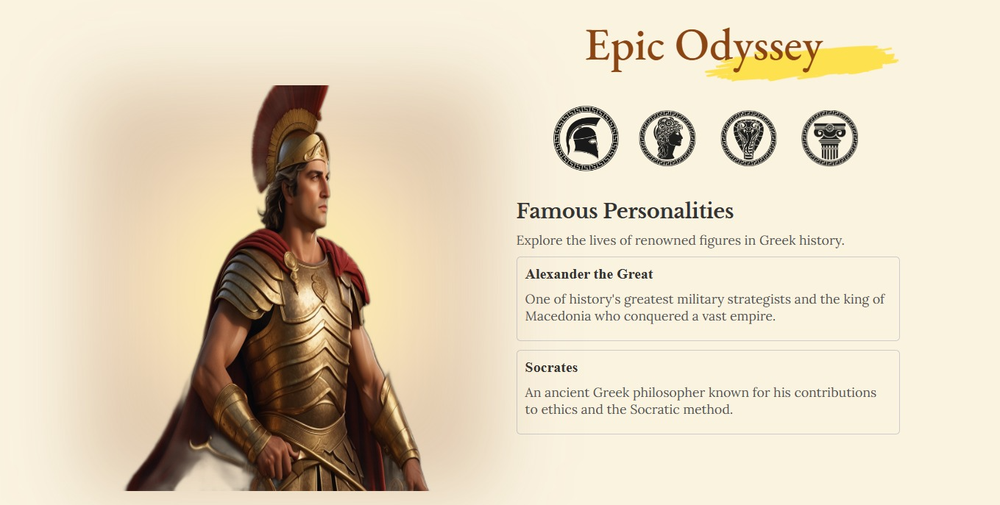

# Epic Odyssey

Epic Odyssey is a React application that showcases information about famous personalities, organized into different categories. Users can explore details about various figures and their accomplishments.

## Features

- Dynamic tab selection to switch between different categories.
- Rich content display for each category, including descriptions and examples.

## Live Demo

You can access a live demo of the application [here](https://epic-odyssey.netlify.app/).

## Screenshot

## Contributing

Feel free to contribute to this project. If you find any issues or have suggestions for improvements, please open an issue or create a pull request.

## Contact Me

If you have any questions or suggestions, feel free to contact me:

- GitHub: [Adham Nasser](https://github.com/Adhamxiii)
- Linkedin: [Adham Nasser](https://www.linkedin.com/in/adhamnasser/)
